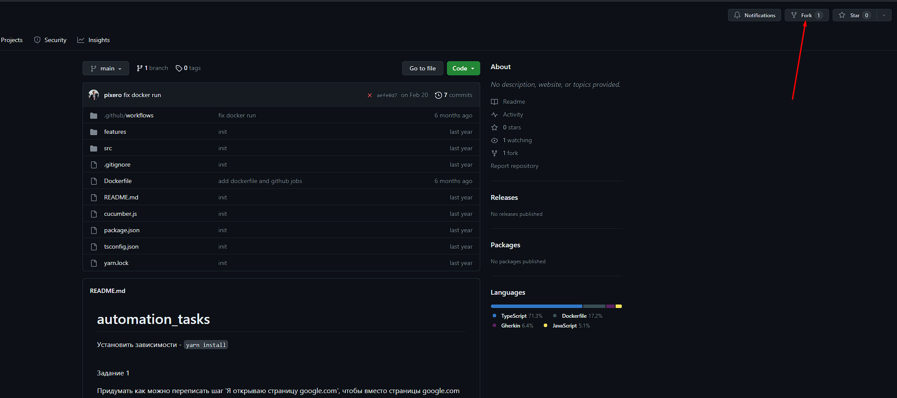
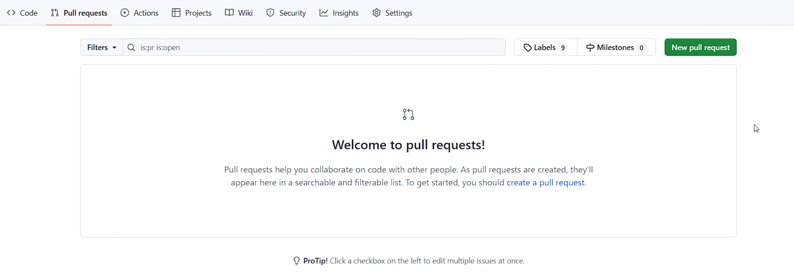
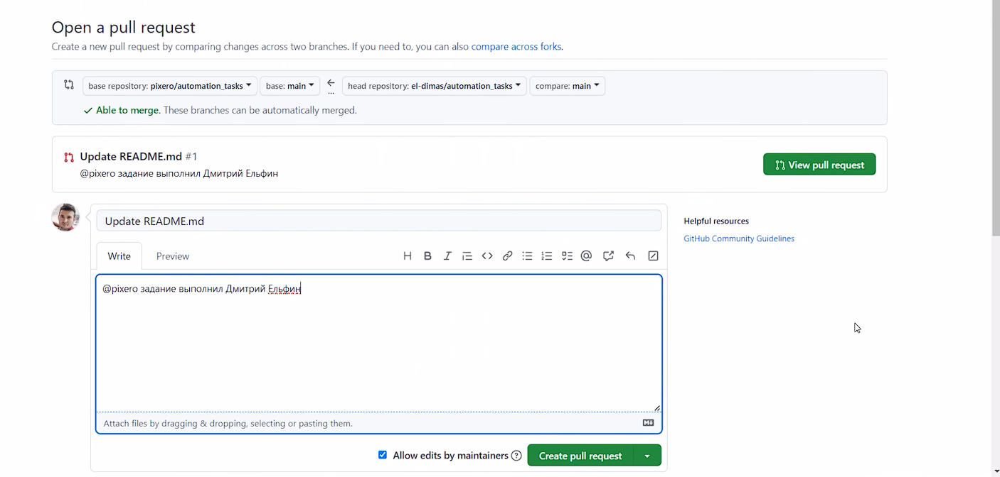

# automation_tasks

@pixero задание выполнила Хаирова Екатерина
Чтобы выполнить задание необходимо создать fork репозитория.

Далее склонировать репозиторий себе на компьютер и установить зависимости - `yarn install` 

Для отправки задания: 
В fork репоизтории перейти на вкладку `pull requests`

Нажать `New pull request` 
В описании pull request указать: @pixero задание выполнил ФИО 

И нажать кнопку `create pull request`
 <b>Задание 1</b>

Придумать как можно переписать шаг 'Я открываю страницу google.com', чтобы вместо страницы
google.com можно было открыть
URL любой страницы при помощи изменения параметра шага в feature файле.

<b>Задание 2</b>

1. Добавить Page Object для страницы `google.ru` в папке `src/pages`
2. Добавить в объект страницы метод `goto`, в котором будет открываться страница `google.ru`
3. Добавить метод `search`, где будет выполняться поиск по значению аргумента функции.
   Подобрать css локатор таким образом, чтобы на странице встречался только один элемент.
4. Добавить feature файл и реализацию шагов в src/step-definitions для теста на открытие страницы google.ru
5. Добавить feature файл и реализацию шагов в src/step-definitions для теста на поиск по строковому значению "Море" на странице google.ru

Примечание: тесты можно запустить командой `yarn run test`  
<bold>Необходимая информация для выполнения задания:</bold> 

1. Playwright doc - https://playwright.dev/
2. Cucumber doc - https://docs.cucumber.io/docs/gherkin/reference/
3. Page Object - https://habr.com/ru/company/wapstart/blog/138674/
